== SchedTest Suite

The main goal of this test suite is to support the validation of a
big.LITTLE MP scheduler configuration. This section explains:

* <<SchedTestSuite_Installation, How to install the suite>>
* <<SchedTestSuite_Usage, How to use the suite shell>>
* <<SchedTestSuite_Configuration, How to configure the test suite>>
* <<SchedTestSuite_Workflow, Usage workflow and example>>

[[SchedTestSuite_Installation]]
=== Installation

The test suite must be installed in a HOST machine which will be used to
configure and build the suite.  This is the list of mandatory tools which are
expected to be available in the HOST machine:

a. Essential building tools (e.g., the “build-essential” packages on Debian
   based systems)
b. An ARM cross-compilation toolchain on your path (e.g.
   arm-linux-gnueabihf-gcc)
c. Autotools (i.e. autoconf, automake and libtoolize)
d. SSH client (for Linux targets)
e. ADB binary (for Android targets)
f. ncurses library (to run the Kconfig configuration tool)

For example, in Ubuntu 12.04 you can get a working environment suitable for
SchedTest compilation by running this command:

[source,bash]
----
  $ sudo apt-get install build-essential autoconf automake libtool \
                 git-core ncurses-dev moreutils gawk curl aterm
----

You can download the stand-alone Android SDK Tools packages, which provide
the basic SDK tools to interact with an Android device, following the
instruction on the dedicated
http://developer.android.com/sdk/index.html#Other[Android Developers Tools]
webpage.

In the rest of this documentation we assume the user has installed the
SchedTest suite in the +<SchedTestFolder>+.

.Note on Linux target access
The simplest way to get access to a Linux target via SSH to run the tests
is by logging in as +root+ user without a password. To enable such an access
please ensure that these conditions are meet:

1. The root user has an empty password, i.e. you have this entry on your
   +/etc/shadows+ configuration file: +root::16486:0:99999:7:::+, notice the
   pair +::+ after the username

2. You OpenSSH server is configured with these options:

   PermitRootLogin yes
   PermitEmptyPasswords yes
   PasswordAuthentication yes
   UsePAM no

[[SchedTestSuite_Usage]]
=== Usage

The main steps to run the SchedTest suite are:

1. Configuring the suite
2. Building and installing the configured suite locally
3. Installing on the target and running the tests
4. Collecting and analyzing the results

The following sections details each one of these steps.  It is worth knowing
that the suite provides a shell configuration which makes it easy to access
the main commands.  To enable such a shell the user should source the
+init_env+ configuration file provided in the root of the SchedTest suite,
i.e.

[source,bash]
----
$ . init_env
----

WARNING: the provided configuration is just for the BASH shell.

Once the shell has been configured this is the appearance of the SchedTest
Shell:

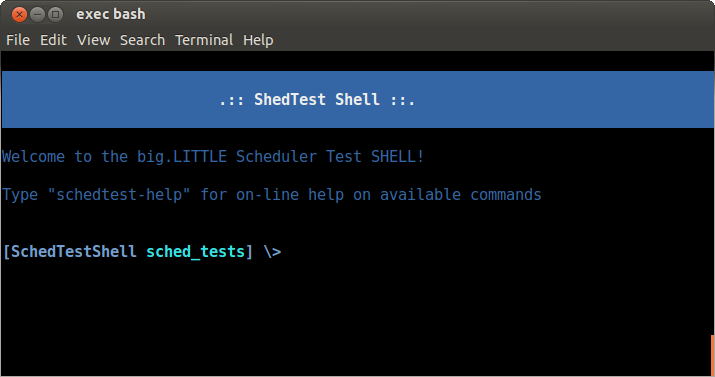

Online help is always available within the SchedTest shell, you can access
it with the command:

[source,bash]
----
$ schedtest-help
----

Which gives you access to a short list of the main available commands:

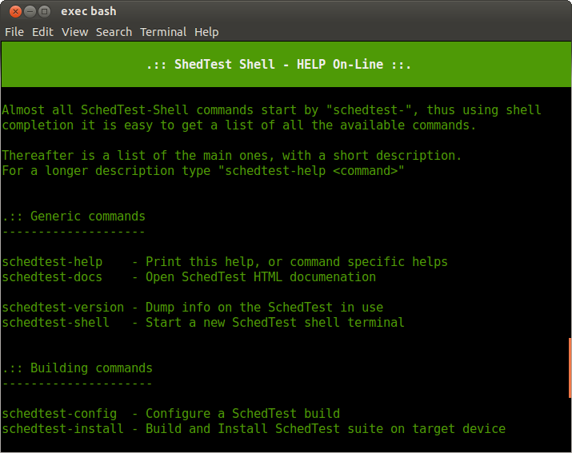

[[SchedTestSuite_Configuration]]
==== SchedTest Suite Configuration

The configuration of the suite is meant to define which tests should be run on
the target as well as all the required options to properly deploy the suite on
the target. Also run the set of required tests and to collect execution traces and
results.
Such a configuration is supported by a +schedtest-config+ command and the
Kconfig configuration tool.

[[Configuration_Command]]
.The SchedTest Configuration Command
The +schedtest-config+ command allows the user to:

a. Load a predefined configuration, among the ones available in the local
   installation
b. Setup a new configuration or tune the current one
c. Save the current configuration as a default config
d. Reset completely the current configuration

All the supported configuration options are reported by issuing the command
without any arguments:

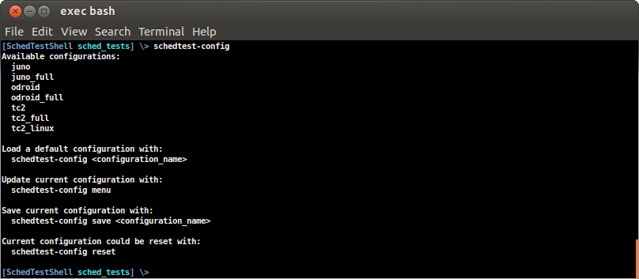

The available local configurations are listed by this command and they can be
loaded by simply passing the corresponding name as the first parameter.
For example, to load the default configuration for a TC2 board running Android
you just need to run this command:

[source,bash]
----
$ schedtest-config tc2
----

The names of the provided configurations have been defined using the
"+target[_linux][_full]+" pattern, where:

target:: is the name of a supported board
_linux:: is an optional tag to identify a configuration for a Linux target, if
this tag is missing the configuration is assumed to be for an Android target
_full:: is an optional tag to identify a configuration which runs all the test
suites and relative testacases supported by the specified target

Thus, for example:

- +tc2_linux+ is the default configuration for a TC2 board running Linux
- +juno_full+ is the default configuration for a Juno board running Android

Once a default configuration has been loaded it is worth checking always the
options using the Kconfig interface.

WARNING: Some configuration settings depend on the specific targets and they
require manual tuning.
For example, the IP address of a Linux target must always be properly
configured using the dedicated Kconfig option.

[[Configuration_Kconfig]]
.The Kconfig configuration interface
KConfig is the standard tool used to configure a Linux kernel build, thus most
of the users of the SchedTest suite are expected to be familiar with this tool.

To start the Kconfig tool to check or update the current configuration you can
use the command:

[source,bash]
----
$ schedtest-config menu
----

which will open an ncurses based interface

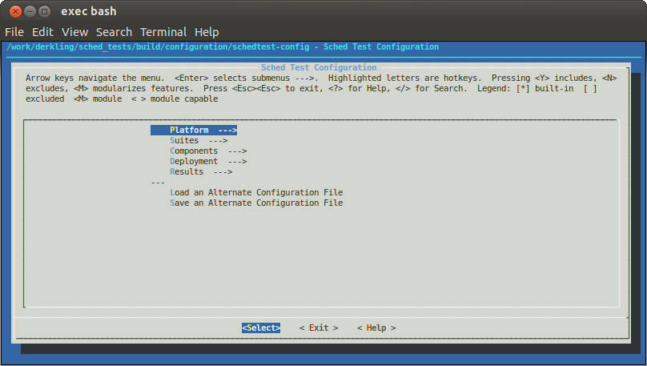

The configuration options for the SchedTest suite are grouped in five main
categories:

[[Configuration_Platform]]
Platform::
Defines the target we want to test, which can be either a Linux or Android
system, and the specific board, which can be selected among the set of
supported boards.
Among these options this menu allows the verification and (eventually)
the customisation of  some target specific options, such as the number and IDs of big and LITTLE
cores available on the target, the range of supported operating frequencies and
the prefix for the toolchain to be used for the compilation of the assets to
deploy on the target.

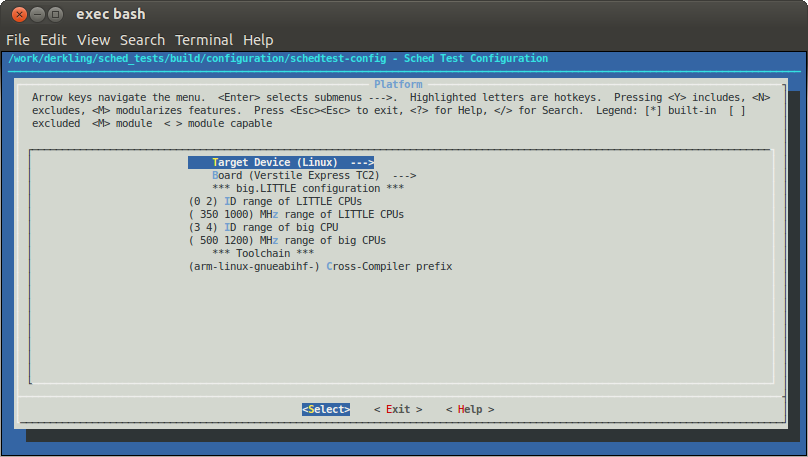

[[Configuration_Suites]]
Suites::
This menu lists all the supported test suites which can be executed on the
configured target platform.
Each suite can be independently selected and in that case by entering the
corresponding submenu, the testcases of the corresponding suite are listed.
Each testcase can be independently selected.

WARNING: only the selected testcases will be installed in the target
and executed for the corresponding testcase.

NOTE: if you are interested on a specific testcase, for example because it was
reported to fail and you want to run it multiple times to check if the failure
is constant, you should disable all the test suites but the one of the testcase
of interest. Within this suite enable only the testcase of interest.

For example, the following two screenshots show how to configure the execution
of the only +core_test_scn3.2a+ testcase.
This is done by enabling only the basic suite:

image::images/SchedTestShell/Kconfig_Suite_Basic.png[Single suite selection example]

and then selecting the single testcase of interest:

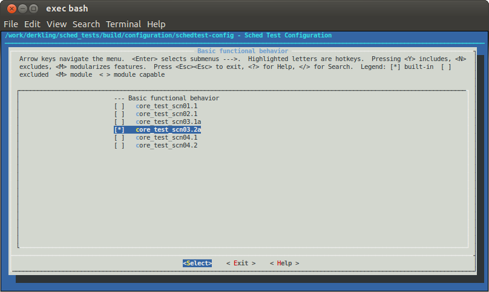

[[Configuration_Components]]
Components::
This is just a utility menu which shows the binary components provided by the
SchedTest suite which are going to be installed on the target.

CAUTION: the user is not expected to tune the options of this menu, which will
likely be hidden in a future version.

[[Configuration_Deployment]]
Deployment::
The deployment menu collects all the configuration options which allow to
define how the SchedTest suite will be deployed on the target. Some of these
options deserve a better explanation:

The _deployment path_ is the path on the target where the suite is going to be
installed and the testcases executed.

WARNING: The +Deployment path+ must be on a writable partition of a
medium on the target device and pointing to a folder with writable permission
for the user used to connect with the board.

CAUTION: The SchedTest suite requires also a writable +/tmp+ folder

The _tasklibrary calibration_ file is a textual file which is generated by the
tasklibrary component the first time it is executed on the target. The goal of
this file is to measure and collect all the calibration values required to
generate a required amount of load on each and every CPU of the target system.
Generating such a file requires minutes and thus it can have a significant
impact on the overall tests execution time, especially when some simple
tests need to be executed.
It is enough to build this file just one time for each new target platform.
An option allows the calibration file to be backed up once it has been built the first
time on a new target.
Once this file has been backed up, the same option allows the reuse of a previously
built calibration file by pushing it on the target along with the other assets.

An _SSH or ADB configuration_ section is also exposed by the menu, depending on
the configured target being Linux or Android.
These options allow the proper configuration of the corresponding tool to properly
access the target. For example, an IP address should be specified to access a
Linux target.

Finally, the deployment section allows the generation of an
_auto-installation package_ for the current SchedTest configuration. The usage
of self-configuration packages is explained in a following section.

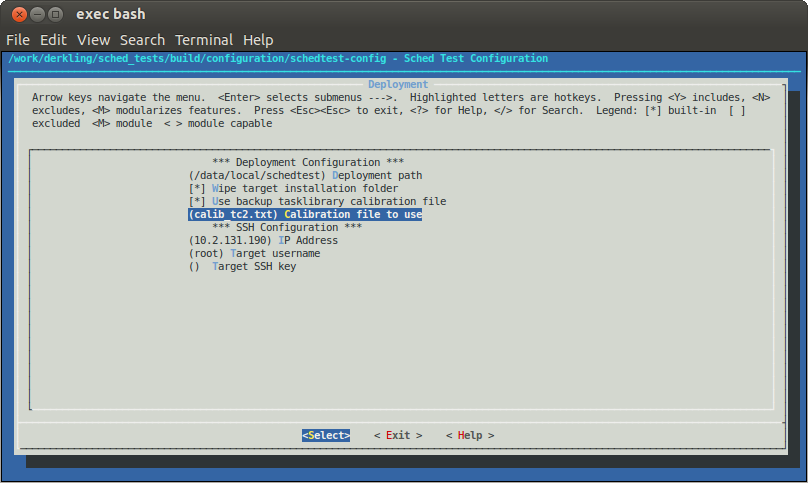

[[Configuration_Results]]
Results::
This menu allows the selection of some specific options regarding results collection.
Specifically, via this menu it is possible to define how many runs should be run
for each testcase executed.

WARNING: This option affects *all* the configured testcases. Thus, it is
usually suggested to run a first batch of experiments using just one iteration
and then reconfigure the suite to have multiple runs but just for the subset of
testcases which have failed.

This menu allows you also to force the collection of binary traces which are
generated during experiments.
In that case, binary traces will be collected on the host machine where they
will be available for further analysis to investigate the reasons for a
testcase failure.

Finally, an advanced Ftrace configuration option allows to define which events
should be collected during an experiment. This can be useful to
better investigate the reasons for a testcase failure.

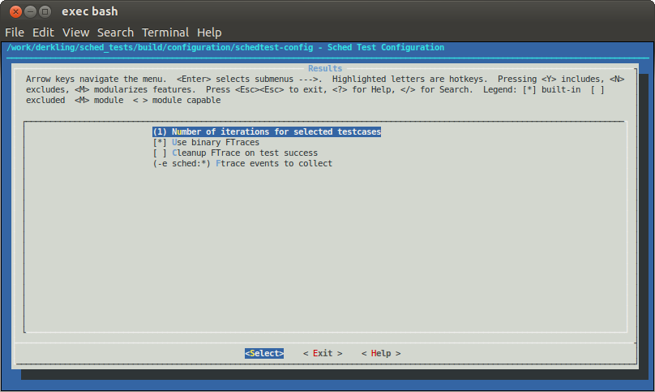

[[SchedTestSuite_Packaging]]
=== Binary installation package

The SchedTest suite could be built as a standalone binary installation
and execution package. This option allows the build of preconfigured releases
so as to run the suite on multiple targets or to easily setup a collection
of regression tests.

The binary release package is built based on the current active configuration.
The set of selected test suites and test cases are packed into a self-extracting
bash archive along with a minimum set of scripts required which allow
deployment of the tests on a Linux or Android target, the trigger of their execution and
to collect back the results.

To generate a binary installation package, the SchedTest shell provides the
command:

[source,bash]
----
$ schedtest-package [name]
----

The output of such a command will be similar to the one reported on this
screenshot:

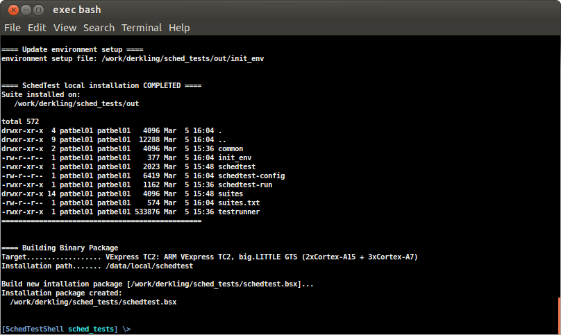

The full path of the generated installation package is reported in the putput.
The name of the package to generate could be specified as an optional parameter,
by default it is set to "schedtest".

.Binary package usage
The tests collected into a binary installation package could be executed on
a defined target by simply executing the package and following the
simple on-screen instructions.

The following figure reports an example of the available execution options:

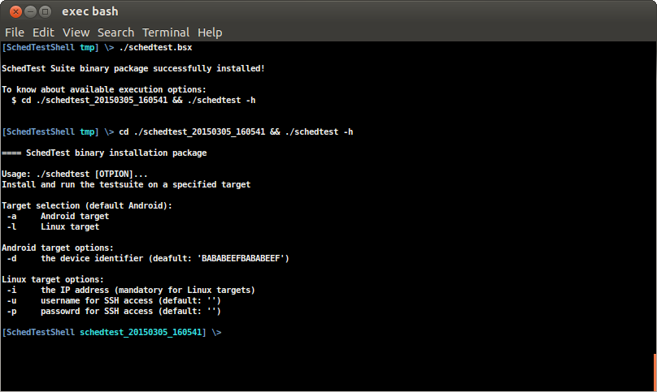

Thus, when the binary package is executed a new folder is created which contains
the binary installation of the SchedTest suite as well as the +schedtest+
script which allows the deployment and execution of this suite on a specified target.

The only available options allow the definition of the target for the
experiment. For example, to run an a Linux TC2 target, the required command
line will be:

[source,bash]
----
$ schedtest -l -i <TARGET_IP_ADDRESS> -u <USERNAME> -p <PASSWORD>
----

[[SchedTestSuite_Workflow]]
=== Typical usage workflow

This section describes a typical usage workflow assuming the test suite has been
already installed in the +<SchedTestFolder>+.

* Enter the suite main folder and load the SchedTest shell

[source,bash]
----
$ cd $SCHEDTESTFOLDER
$ . ./init_env
----

* (Optional) reset the suite configuration and load a default configuration for
  the selected target, in this example we assume a TC2 board:

[source,bash]
----
$ schedtest-config reset
$ schedtest-config tc2
----

WARNING: a configuration reset is required each time you want to switch the
current target.  There are some internal configuration options which
are target related but these are only updated when starting with a configuration reset.

* Check the current configuration and eventually tune the required
  suites/testcases to run, the deployment options and the results collection
  options

[source,bash]
----
$ schedtest-config menu
----

CAUTION: check the target access configuration options under the deployment
menu. For android, ADB should be properly configured. For a Linux target the IP
address of the board should be configured.

TIP: you can speedup test execution by using a backup calibration file,
which can be specified in the Deployment menu.

* Install the configured suite both locally as well as on the target

[source,bash]
----
$ schedtest-install
----

A detailed log of the installation is reported in the console. If everything
completes successfully you should get a notice that the suite has been
installed in the specified target folder.

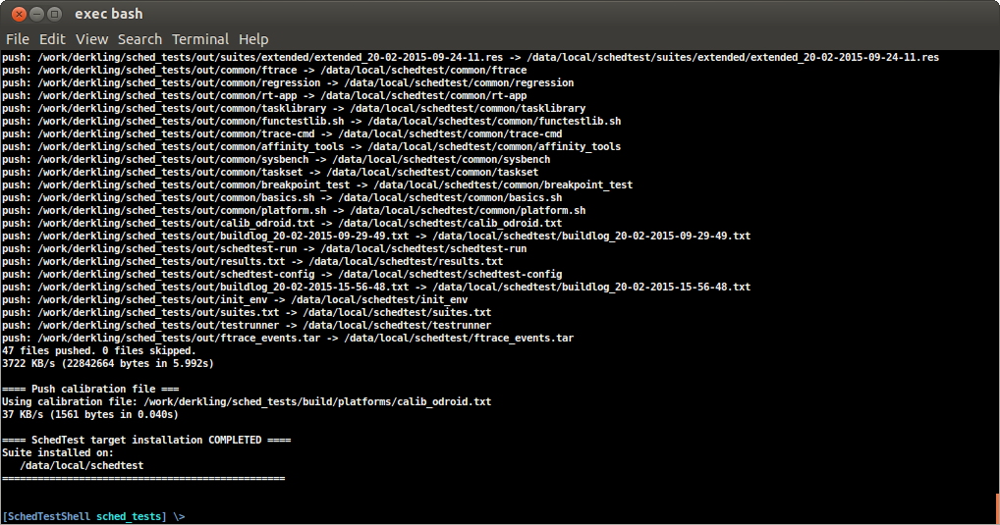

NOTE: The local "out" folder contains an image of the target content. You can
check the local "out" folder to verify what has been installed on the target.
This "out" folder will contains also the results of the tests once they have
been completed and pulled from the target.

*  Run all the configured test suites on the target

[source,bash]
----
$ schedtest-run
----

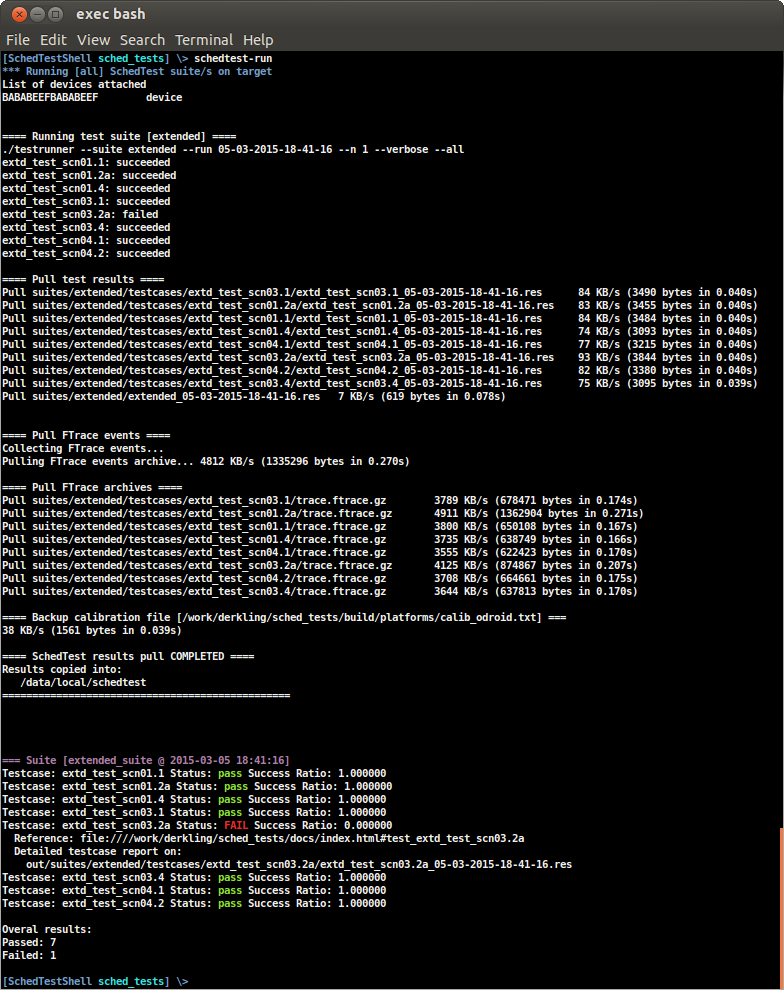

NOTE: this command will execute all the testcases of the configured enabled test
suites.

TIP: you can limit execution to the testcases of a single test suite by
specifying the test suite name as an argument of the +schedtest-run+ command.

You can follow the test execution by looking at the console log, which reports
the results for each testcase as soon as it has completed. Once all the tests
have been completed you get an overall report of the testcases results. For
example:

[source]
----
=== Suite [extended_suite @ 2015-02-20 09:24:11]
Testcase: extd_test_scn01.1        Status: pass Success Ratio: 1.000000
Testcase: extd_test_scn01.2a       Status: pass Success Ratio: 1.000000
Testcase: extd_test_scn01.4        Status: pass Success Ratio: 1.000000
Testcase: extd_test_scn03.1        Status: pass Success Ratio: 1.000000
Testcase: extd_test_scn03.2a       Status: FAIL Success Ratio: 0.000000
  Reference: file:////work/derkling/sched_tests/docs/index.html#test_extd_test_scn03.2a
  Detailed testcase report on:
    out/suites/extended/testcases/extd_test_scn03.2a/extd_test_scn03.2a_05-03-2015-18-41-16.res
Testcase: extd_test_scn03.4        Status: pass Success Ratio: 1.000000
Testcase: extd_test_scn04.1        Status: pass Success Ratio: 1.000000
Testcase: extd_test_scn04.2        Status: pass Success Ratio: 1.000000

Overal results:
Passed: 7
Failed: 1
----

In this example all the testcases of the "Extended" suite have been executed
and one of them failed, namely +extd_test_scn03.2a+.

NOTE: for each failed test a link to the embedded HTML
documentation is provided which describes the experiment.

For each failed test case, the referenced report contains a detailed log of the
experiment execution. Looking at this logfile is helpful to identify
the possible reasons for a failure.

* Reconfigure the suite to focus on failed test

In the some tests should fail, it is usually beneficial to run
only the failing test cases with an increased number of iterations. To do that, just
start the configuration menu and disable all the test suites/cases but the one
of interest and set an higher number of iterations (e.g. 10). Install and run
again the newly configured suite and check the "passing ratio" of the specific
test case.

* Check tests execution results

The results of the tests executed are collected locally and are available in
the +results.txt+ file within the +./out+ folder.
These results can always be viewed on screen using the dedicated shell
command:

[source,bash]
----
$ schedtest-results
----

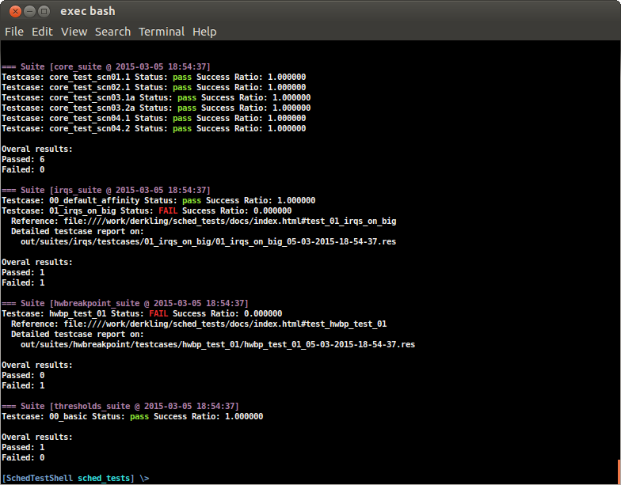

* Archive the collected results

All the results available in the output folder can be collected and archived
into a tarball using the dedicated shell command:

[source,bash]
----
$ schedtest-archive
----

This command will generate a +tar.gz+ archive into the local folder which is
named similar to this example:

  testrun_20-02-2015-17-04-17.tar.gz

ie a +testrun_+ followed by the date and timestamp of when the archive
has been created.

This archive contains the complete content of the local output folder, which
means: test cases and collected results. Thus, it is a suitable archive to be
eventually circulated and/or installed by hand on another similar target
to agian run the contained test cases.

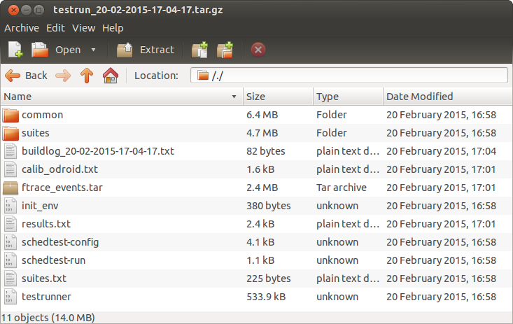

[[SchedTestSuite_Components]]
=== Components

This section briefly introduces and describes some of the main tools
that are a part of the test suite and that are used internally by the commands of the SchedTest
suite shell. In the normal case, it is not required to know what these
commands are and how they work.  Advanced users can find the
description useful to better understand how certain tests are defined and how they are
executed.

[[SchedTestSuite_Testrunner]]
==== Testrunner

The testrunner application is the user entry point for the test harness
framework.
This application is installed by the SchedTest suite on the target device and
is the actual tool used to trigger the execution of the installed tests. The
user is not required to interact directly with this tool, however it can be
interesting to know how it works in case some advanced experiments or testing
scenarios not covered by the suite needs to be executed by an advanced user.

It is worth knowing that these tools rely on a simple DB of available
tests, which is represented by the TXT file named +suites.txt+ that is present
in the +./out+ installation folder. Only the suites listed in
that file can be executed by the testrunner component.

.Usage Examples
The following are some usage examples that showcase the functionality of
testrunner.

NOTE: this tool is meant to be executed on the target, where it is available at
the root of the installation folder.

* display all the existing suites known to testrunner:

  $ testrunner --list

* list all test cases composing the '+example+' suite

  $ testrunner --list --suite example

NOTE: only the suites listed in the '+suites.txt+' file are available for
execution

* run '+testcase0+' that belongs to suite '+example+' once:

  $ testrunner --run --suite example --testcase testcase0

* run 10 times every testcase in suite '+example+':

  $ for i in `testrunner --list --suite example`; do
      testrunner --run --n 10 --suite example --testcase $i
    done

* prints the description of the testcase '+tc1+' which belongs to suite '+example+':

  $ testrunner --desc --suite example --testcase tc1

[[SchedTestSuite_Tasklibrary]]
==== Tasklibrary

.Load sequence language
A load sequence is made up of a number of timed points, where the time is
specified in milliseconds. All times are relative to the start of the load
trace, *not* the previous timed point. At each point, the load to be generated
relative to a given CPU's calibration is given as a percentage.

For example, to start a 50% load equivalent to that of CPU0 at 1[s], the timed
point looks like:

  1000,0.50

Which follows the standard format of:

  <time in ms>,<cpu number>.<percentage load>

The timed points can be joined together to form a sequence using a separator.

  1000,0.50:2000,1.100

This starts a load equivalent to 50% of CPU0 after 1[s], and after 2[s]
switches to 100% of CPU1

.Interpolated Loads
A timed point can be extended to generate a linear interpolation based on 10
intervals between two calibration points. To do this, use a '-' symbol between
two timed points, like so:

  1000,0.50-2000,1.100

This represents a linear interpolation over 1s between 50% of CPU0 and 100% of CPU1.

.CPU Identifiers
When selecting load to generate, the assumption is that task placement will be
controlled by the environment.
There is no control in the language over where the load is executed - it runs
in the context of the main thread of the running executable.

CPU identifiers used in the language refer to the calibration data for a given
CPU. There are however two special CPU identifiers which we have not
shown so far.

* B or b - selects the CPU with the largest calibrated number for 100% load
* L or l - selects the CPU with the lowest calibrated number for 100% load

e.g. generate load equivalent to 50% of the biggest CPU available looks like:

  1000,B.50

.Ending a load sequence
A load sequence does not need to have an explicit end. When one is not present
the previous load point will be maintained until the exe is killed.
If you wish to end the load generation at a specific time, then you can use end
in place of a CPU:

  0,0.0:1000,0.100:2000,end

is a load sequence starting at 100% after 1[s] of idle and ending after 2[s].
The 'end tag' must be the last tag and there can be only one.

.Load Sequence Files
In order to make it easy to share test loads, the load sequences can be stored
in a plain ascii text file. The format is exactly the same and line endings are
ignored.
For convenience, if a separator is not present but a line ending is, the
default +:+ separator is assumed.

.Changing Priority
You can optionally set the process priority in any step by including an
additional dot field in a step. The priority is set like 'nice', so is between
-20 and 20 with the default being read from the system.

Example::
this load sequence starts at 'system default' nice, goes to nice -20 at 1[s],
stays at nice -20 at 2[s] and to nice 0 at 3[s]:

  0,l.10:1000,l.10.-20:2000,l.10:3000,l.10.0

NOTE: If a nice value is not set at the beginning, the current priority is read
and used.

NOTE: When a nice value is set, it remains in place until you change it.

[[SchedTestSuite_FtraceAnalyzer]]
==== Ftrace Analyzer

This tool allows the analysis of a trace of kernel events looking for a set of
configured events regarding tasks scheduled on different CPUs. Different kinds
of analyses are supported, each one being provided by a plugin. Each
plugin/analysis can be configured by specifiying a set of environmental
variable to define thinks such as: tasks of interest, expected scheduling on
big or LITTLE CPUs and time for their migration.

.Usage
  ./ftrace -t tracefile -l ./libanalizis.so

Will analyze the 'tracefile' trace which is expected to be TXT trace generated
by reading the +trace+ attribute of the sysfs kernel tracer interface or by
using the 'report' command of the +trace-cmd+ tool.

Hereafter is a short description of the two main useful plugins which are used
by some testcases.

.libbiglittleswitch.so.1.0.0
The goal of this plugin is to verify the transition from an initial condition to
a final one for a specified set of tasks. This plugin can be used to verify,
for example, that a specified workload is moving from LITTLE CPUs to big ones
within a specified time interval.

To confiugre the plugin these environment variables can be defined:

Conf start::
* START_BIG = pid0,pid1,...
* START_BIG_PRIORITY = pid0_prio,pid1_prio,...
* START_LTTILE = pid100,pid101,...
* START_LITTLE_PRIORITY = pid100_prio,pid101_prio,...

Conf end::
* END_BIG = pid0,pid1,...
* END_BIG_PRIORITY = pid0_prio,pid1_prio,...
* END_LTTILE = pid100,pid101,...
* END_LITTLE_PRIORITY = pid100_prio,pid101_prio,...

Time to move from first in milliseconds::
From EXPECTED_CHANGE_TIME_MS_MIN to EXPECTED_CHANGE_TIME_MS_MAX

Minimum time in end state in milliseconds::
From EXPECTED_TIME_IN_END_STATE_MS

.libprocess_matrix.so.1.0.0
The goal of this plugin is to compute and eventually verify the overall
execution time of a specified workload on different CPUs. This plugin can be
used to verify, for example, that a specified set of tasks are scheduled for
execution up to a maximum percentage of the overall execution time on a
specified set of CPUS.

To configure the plugin these environment variables can be defined:

Conf analysis interval::
* PID
* START
* STOP

Tasks residency checks::
* CPUS_MASK mask of the CPUs to consider
* USAGE_MIN minimum percentage of time tasks can be scheduled on the CPUs defined by the CPUS_MASK
* USAGE_MAX maximum percentage of time tasks can be scheduled on the CPUs defined by the CPUS_MASK
* TIME_MIN minimum amount of time tasks can be scheduled on the CPUs defined by the CPUS_MASK
* TIME_MAX maximum amount of time tasks can be scheduled on the CPUs defined by the CPUS_MASK

.Examples
Store ftrace in binary format in file_to_store_my_trace:

  ./ftrace -s file_to_store_my_trace

See what a library, e.g. libanalyzis4.so, is doing:

  ./ftrace -q ./libanalyzis4.so

Show all available library internally or in current directory

  ./ftrace [-L]

Show all available library internally or in current directory and their description:

  ./ftrace [-LL]

// vim: set syntax=asciidoc:
