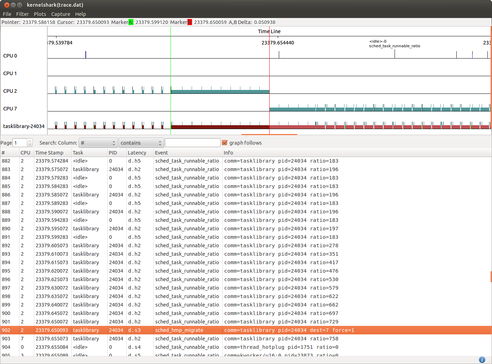

[[test_core_test_scn01.1]]
==== core_test_scn01.1

.Goal
Verify up migration of a task once it generates an increased CPU demand

.Detailed Description
This test starts with a light task running on the LITTLE domain which is then
subject to a increase of load demand. The expected behavior is that the
big.LITTLE MP scheduler extensions move the task to a CPU of the big domain as
soon as the tracked task load becomes bigger than the configured *up_migration*
threshold.

.Expected Behavior
The expected behavior is reported in the following figure:

The tasklibrary-24034 task generates initially a low load till the
[green]#green marker#.  After that time point its execution pattern changes to
be a CPU bound with almost no idle periods. As the runnable time is longer
than idle time, the tracked task load increases over time as reported by the
+ratio+ metrics of the +sched_task_runnable_ratio+ events.

At the time of the [red]#red marker# the measured task load is 729, which is
higher than the 700 *up_migration* threshold configured on this test.
At that point the big.LITTLE MP scheduler extensions trigger a "forced
migration" (force=1) to move the now high demanding task to a CPU of the big
domain (CPU7 in this case).  Roughly ~50ms have been required to build up a
running ratio suitable to trigger an up migration.

NOTE: a timeout is defined by this experiment to specify the maximum time
      considered acceptable for the task to be migrated.
      By default the migration time is expected to happen between
      1.7 and 2.2 [s] since the start of the experiment.

.Possible Issues

The main reasons for this test to fails could be:

. *up_migration* threshold configured to be 1024
  in this case the task will never be up-migrated since the maximum load a task
  could build is capped to 1023.

