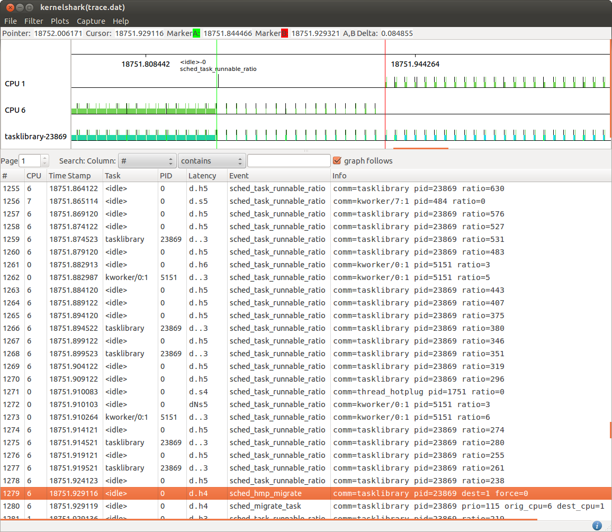

[[test_core_test_scn02.1]]
==== core_test_scn02.1

.Goal
Verify down migration of a task once it generates a decreased CPU demand

.Detailed Description
This test starts with a heavy task running on the big domain which is then
subject to a decrease of its load demand. The expected behavior is that the
big.LITTLE MP scheduler extensions move the task to a CPU of the LITTLE domain as soon as the
tracked task load goes below the configured *down_migration* threshold.

.Expected Behavior
The expected behavior is reported in the following figure:

The tasklibrary-23869 task generates initially a big load till the
[green]#green marker#.  After that time point its execution pattern changes to
show period bursts interleaved by long idle periods. Being idle time longer
than busy time, the tracked task load decreases over time as reported by the
ratio metrics of the sched_task_runnable_ratio events.

At the time of the [red]#red marker# the measured task load is 238, which is
lower than the 250 *down_migration* threshold configured on this test.
At that point the big.LITTLE MP scheduler extensions force a "wakeup migration"
(force=0) to move the now low demanding task to a CPU of the LITTLE domain
(CPU1 in this case).

.Possible Issues

The main reasons for this test to fails could be:

. down_migration threshold configured to be 0
   in this case the task will never

