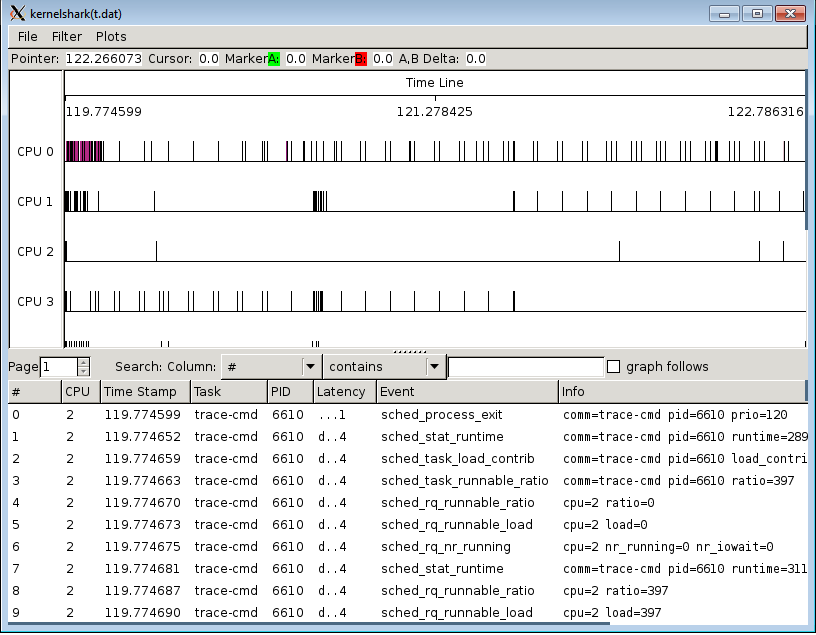

[[test_core_test_scn03.1a]]
==== core_test_scn03.1a

.Goal
This starts with a heavy task on big domain, however the task priority is
modified mid way through execution below cutoff but no migration happens. The
task gets the CPU immediately.

.Detailed Description
This test asserts a priority threshold which prevents low priority task from
migrating. This is useful for user-space software which assigns lower task
priority to background task. +SCHED_HMP_PRIO_FILTER+ enables task priority
based HMP migration filter. Since its of a lower priority, the task does not
migrate. Priority Cut-off value is one of the tunable conditions of the
scheduler for the task to migrate.

.Expected Behaviour
The expected behavior is reported in the following figure:

1. The task library generates heavy load in the beginning. Initial CPU
   assignment is on big domain without any particular CPU affinity and with
   priority > cut-off priority
2. It is assumed that, Idle CPU is available in the cluster
3. Mid way through the execution of the load, priority of the task
   is given  < cutoff priority
4. No migration happens because of the task priority irrelavance in case of
   down migration.

.Possible Issues
The main reasons for this test to fail could be:

. priority filter is disabled
. cut-off priority is not configured

