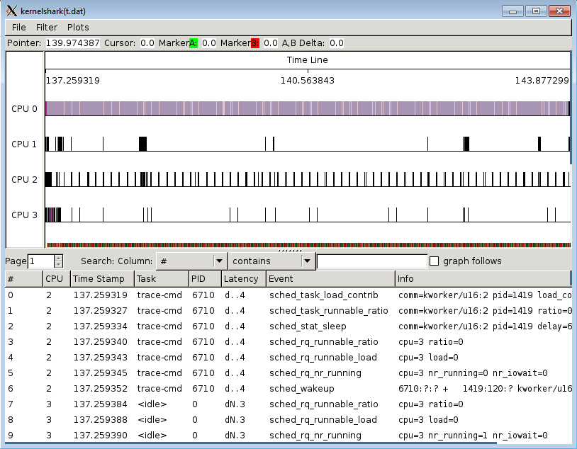

[[test_core_test_scn03.2a]]
==== core_test_scn03.2a

.Goal
This starts with a heavy task however the task priority is modified mid way
through execution below cutoff. Since the big domain is oversubscribed, the
task stays on LITTLE domain

.Detailed Description
This test asserts a priority threshold which prevents low priority task from
migrating. This is useful for user-space software which assigns lower task
priority to background task. +SCHED_HMP_PRIO_FILTER+ enables task priority
based HMP migration filter. When the task priority is modified, the task stays
on big domain.

.Expected Behaviour
The expected behavior is reported in the following figure:

1. The task library generates heavy load in the beginning. Initial CPU
   assignment is on big domain without any particular CPU affinity and with
   task priority > cut-off priority
2. It is assumed that an Idle CPU is *not* available in the big cluster
3. Mid way through the execution of the load, priority of the task is changed
   < cutoff priority
4. No migration happens asserting the relevance of the priority

.Possible Issues
The main reasons for this test to fail could be:

. priority Filter is disabled
. cut-off priority is not configured

WARNING: This test is known to be likely to fail. In these cases, a visual
inspection of the collected trace could be required to verify that the
scheduler behavior is the expected one. The "expected behavior" is the one
reported in the previous figure.
