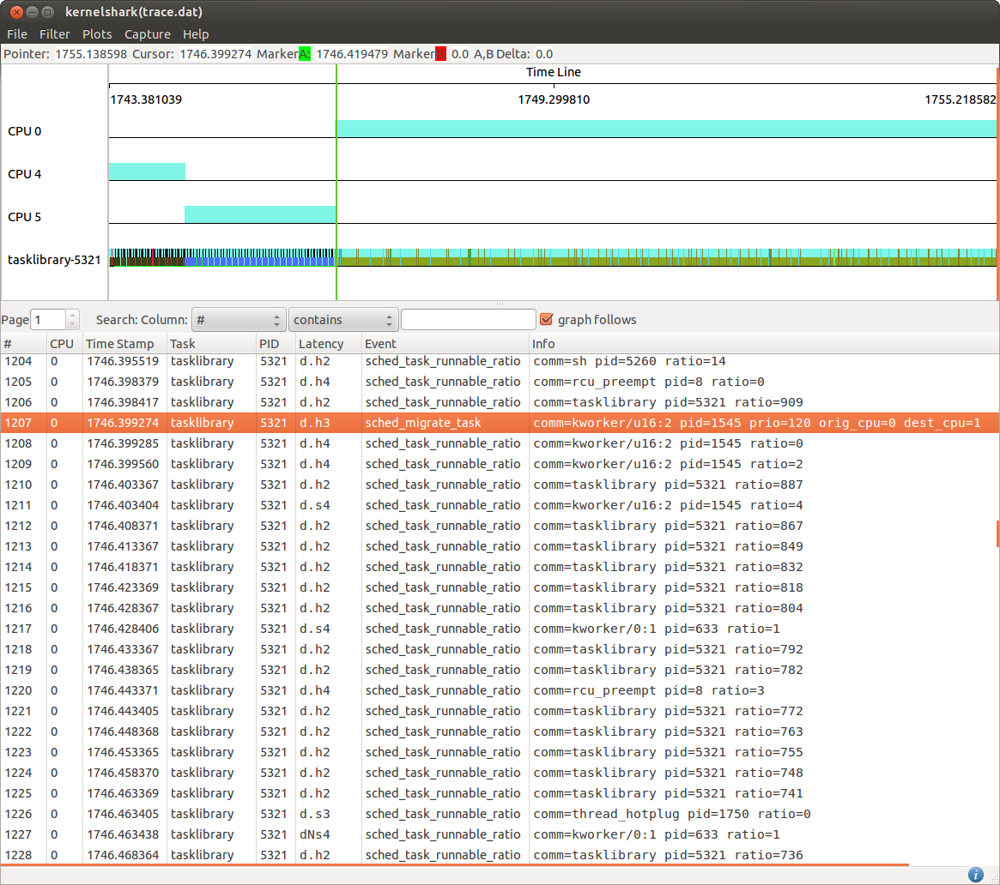

[[test_core_test_scn4.1a]]
==== core_test_scn4.1a

.Goal
Verify CPU affinity enforcing on big tasks

.Detailed Description
This test starts with a heavy task without any specific CPU affinity defined.
Being an high CPU load demanding task, it is expected to be running from the
beginning on a CPU of the big domain.

The CPU affinity mask of this task is modified mid way through execution to
allows its execution just on CPUs of the LITTLE domain. This is expected to
force an immediate migration of the task on a CPU of the LITTLE domain.

.Expected Behavior
The expected behavior is reported in the following figure:

The tasklibrary-5321 task generates an high load and therefore it runs on CPUs
of the big domain, in this example run it starts on CPU4 and then move to CPU5.
This is the expected behavior since before the [green]#green marker# the task
has not a specific CPU affinity mask.

At the time of the [green]#green marker#, the task affinity is forced to be the
CPUs of the LITTLE domain only, at that point the scheduler forces a migration
+sched_migrate_task+ to a CPU of the LITTLE domain even though the task runnable
ratio remains over the *up_migration* threshold.

.Possible Issues

This test is expected not to fail.

