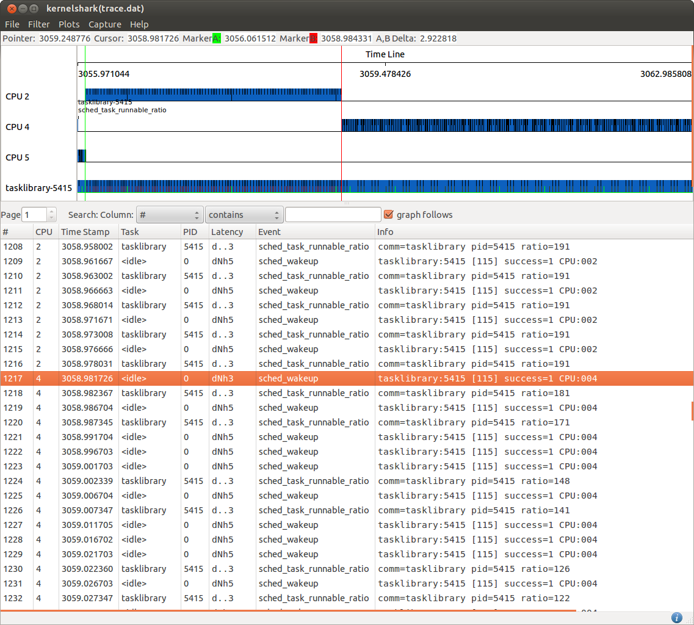

[[test_core_test_scn4.2]]
==== core_test_scn4.2

.Goal
Verify CPU affinity enforcing on small tasks

.Detailed Description
This test starts with a small task without any specific CPU affinity defined.
Being a small CPU load demanding task, it is expected to be running on
a CPU of the LITTLE domain.

The CPU affinity mask of this task is modified mid way through execution to
allows its execution just on CPUs of the big domain. This is expected to
force an enqueuing of the task on a CPU of the big domain, as soon as the task
becomes runnable.

.Expected Behavior
The expected behavior is reported in the following figure:

Generally, new tasks are created on CPUs of the big domain to boost
performance of potentially high load demanding tasks. This is the reason why
the tasklibrary-5415 task starts its execution on CPU5 in this example.
However, as it is a small task and as it is not affinitised to a specific CPU,
as expected, pretty soon after start, precisely at the time of
shown by the [green]#green marker#, it is moved to run on CPU2 of
the LITTLE domain.

At the time of the [red]#red marker#, the task affinity is set to include
only the CPUs of the big domain. Thus, after that point, the first time the
scheduler has the opportunity to decide where to schedule this task, it is
moved into a CPU of the big domain. Being it a small load task, which runs for
short bursts and sleeps longer, in this case, the first opportunity for
migration if the first +sched_wakeup+ right after the time the affinity mask
has been updated.

.Possible Issues

This test is expected not to fail.

