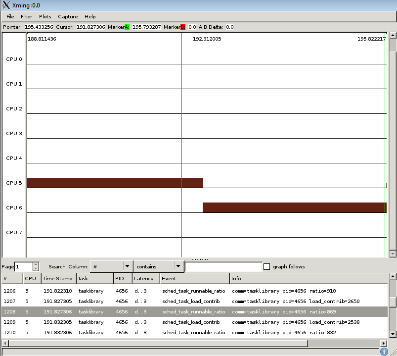

[[test_extd_test_scn01.1]]
==== extd_test_scn01.1

.Goal
Verify *down-threshold* value of a task once it is generating a decreased CPU
demand

.Detailed Description
This scenario assumes the heavy task is already in big domain, however its
computed load is decreasing due to the load pattern (due to idling).The
expected behaviour is that the task stays in big domain since the task load has
not yet crossed below the down-threshold.

.Expected Behavior
The expected behavior is reported in the following figure:

The tasklibrary task generates initially a big load till the
[purple]#purplemarker#.  After that time point its execution pattern changes to
show period bursts interleaved by long idle periods. Being idle time longer
than busy time, the tracked task load decreases over time as reported by the
ratio metrics of the sched_task_runnable_ratio events.

At the time of the [green]#green marker# the task load is not lower than
*down_migration* threshold configured on this test. Load is 473 where as the
threshold is 256. At that point the big.LITTLE MP scheduler extensions *do not*
force a "wakeup migration" to move the now low demanding task to a CPU of the
LITTLE domain.

.Possible Issues

. Down migration threshold is configured to 0

