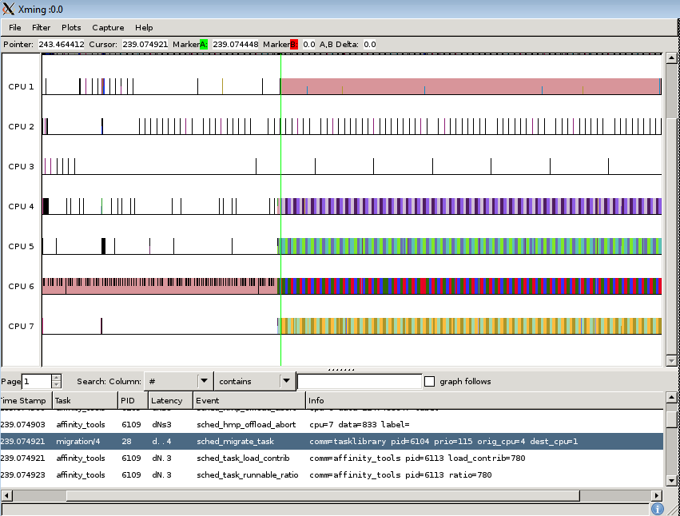

[[test_extd_test_scn01.2a]]
==== extd_test_scn01.2a

.Goal
Verify down migration of a task once the big domain is over subscribed

.Detailed Description
This test starts with a heavy task running on the Big
domain which is then subject to a increase of its load demand. But since no
Idle CPU is available and the big Domain is oversubscribed, the The expected
behavior is that the big.LITTLE MP scheduler extensions move the task to a CPU
of the LITTLE domain.

.Expected Behavior
The expected behavior is reported in the following figure:

1. The task library generates initially a heavy load starting on big domain
2. The CPU affinity is not set at this point. The priority of the task is <
   cut-off priority
3. The task gears up more load but the Big domain is over subscribed
4. Hence a forced task migration happens moving the heavy task to a CPU of the
   LITTLE domain

.Possible Issues
1. Idle CPU being available at the point of migration

