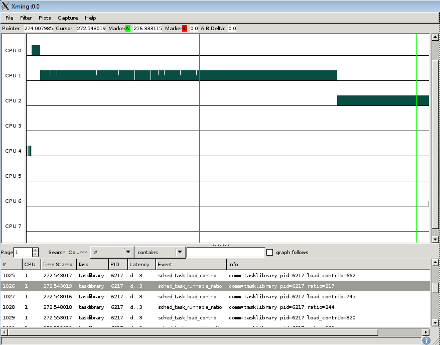

[[test_extd_test_scn01.4]]
==== extd_test_scn01.4

.Goal
Verify *up-threshold* value of a task once it is generating an increased CPU
demand

.Detailed Description
This scenario assumes the light task is already in LITTLE domain, however its
computed load is increasing due to the load pattern (due to run queue
residency).The expected behaviour is that the task stays in LITTLE domain since
the task load has not yet crossed above the up-threshold.

.Expected Behavior
The expected behavior is reported in the following figure:

The tasklibrary task generates initially a light load till the [purple]#purple
marker#.  After that time point its execution pattern changes. The CPU demand
is increased, The tracked task load increases over time.

At the time of the [green]#green marker# the task load (495) is not greater
than  *up_migration* threshold (700) configured on this test. At that point the
big.LITTLE MP scheduler extensions *do not* force a "wakeup migration" to move
the now low demanding task to a CPU of the Big domain.

.Possible Issues

. Up migration threshold is configured to 0

