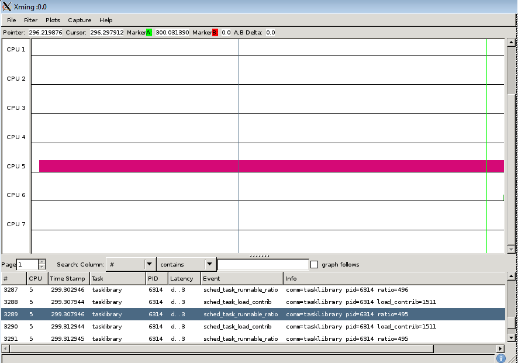

[[test_extd_test_scn03.1]]
==== extd_test_scn03.1

.Goal
Verify *down-threshold* value of a task once it is generating a decreased CPU
demand

.Detailed Description
This scenario assumes a heavy task is already in big domain, however its
computed load is decreasing due to the load pattern (due to idling).The
expected behaviour is that the task stays in big domain since the task load has
not yet crossed below the down-threshold.

.Expected Behavior
The expected behavior is reported in the following figure:

The tasklibrary task generates initially a heavy load till the [purple]#purple
marker#.  After that time point its execution pattern changes. The CPU demand
is decreased, The tracked task load decreases over time.

At the time of the [green]#green marker# the task load (495) is not lesser than
*down_migration* threshold (256) configured on this test. At that point the
big.LITTLE MP scheduler extensions *does not* force a "wakeup migration" to
move the now low demanding task to a CPU of the LITTLE domain.

.Possible Issues

. Down migration threshold is configured to 0

