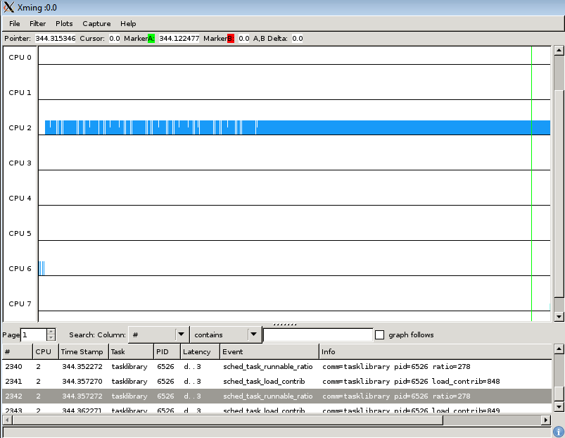

[[test_extd_test_scn03.4]]
==== extd_test_scn03.4

.Goal
Verify that at the down threshold boundary condition, the migration does not
happen.

.Detailed Description
This scenario assumes the light task is already in LITTLE domain however its
computed load is increasing due to the load pattern (due to run queue
residency). The task stays in LITTLE domain eventhough the task load has
reached at the down-threshold. The runnable task gets the CPU immediately.

.Expected Behavior
The expected behavior is reported in the following figure:

1. Initial task load is less than up threshold and equal to down threshold and
   starts with LITTLE domain
2. The CPU affinity is left unspecified and the priority is greater than
   cut-off priority
3. It is assumed that the idle CPU is available
4. Load increases but migration does not happen

.Possible Issues
This test is not expected to fails

