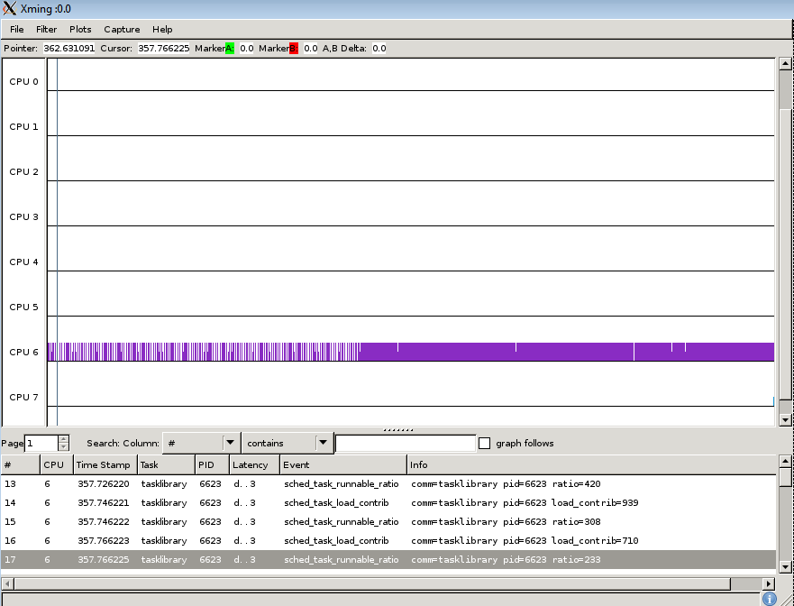

[[test_extd_test_scn04.1]]
==== extd_test_scn04.1

.Goal
Verify that the CPU migration does not precede over CPU affinity during
boundary conditions.

.Detailed Description
This is a light task which started with Big domain due to CPU affinity and
despite migration criteria satisfied is continuing on Big domain. The task gets
CPU immediately.

.Expected Behavior
The expected behavior is reported in the following figure:

1.  Initial task load is less than up threshold and less than down threshold
    and starts with Big domain
2. The CPU affinity is specified as Big domain and the priority is less than
   cut-off priority
3. It is assumed that the idle CPU is available
4. Migration to LITTLE domain does not happen even though it is supposed to, as
   the CPU affinity takes precedence over it

.Possible Issues

. CPU affinity not specified
. cut off priority not specified

