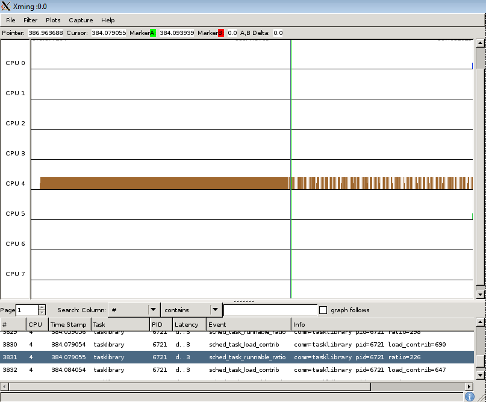

[[test_extd_test_scn04.2]]
==== extd_test_scn04.2

.Goal
Verify that the CPU migration does not precede over CPU affinity during
boundary conditions.

.Detailed Description
This is a heavy task which started in big domain due to initial CPU affinity
being big cores, however despite due to the load pattern (being in idle) and
the computed task load is decreasing below the down threshold, the task
continues on Big domain due to CPU affinity. The task gets the CPU immediately.

.Expected Behavior
The expected behavior is reported in the following figure:

1. Initial task load is less than up threshold and less than down threshold and
   starts with Big domain
2. The CPU affinity is specified as Big domain B0, or B1 and the priority is
   less than cut-off priority
3. It is assumed that the idle CPU is available
4. Migration to LITTLE domain does not happen even though it is supposed to, as
   the CPU affinity takes precedence over it

.Possible Issues

. CPU affinity not specified
. cut off priority not specified

