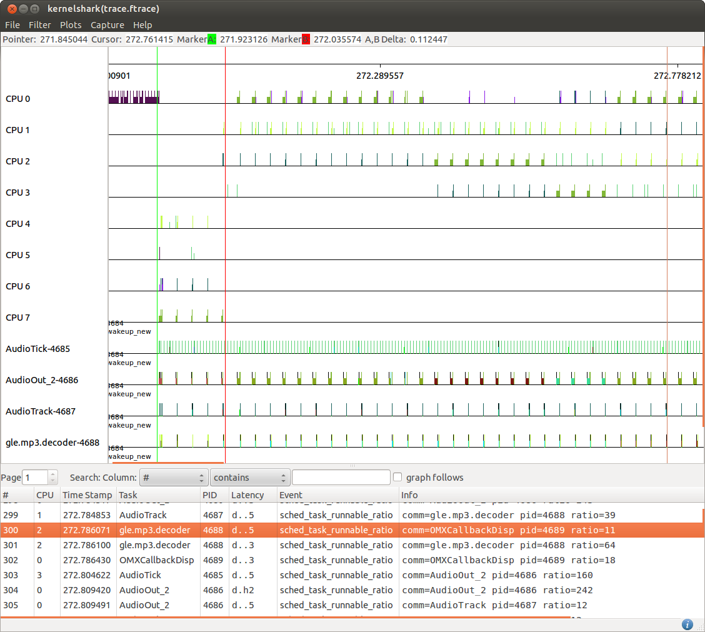

[[test_00_smalltasks]]
==== SmallTasks

.Goal
Assert that small tasks workload runs only on LITTLE CPUs

.Detailed Description
A common usage scenario consisting of just small tasks is represented by the
playback of an Audio stream. Audio decoding and playback is usually performed
using a set of tasks which builds up a processing pipeline.
These tasks are usually relatively low CPU demanding and are expected to be
executed just on LITTLE cpus.

An example audio decoding pipeline is provided by the rt-app workload
generator and it is defined by the +mp3.json+ configuration file.

.Expected Behavior
The expected behavior is reported in the following figure:

Tasks composing the audio decoding pipeline are initially created on big CPUs,
[green]#green marker#, which is an expected behavior due to the FORK migration
mechanism enforced by the big.LITTLE MP scheduler extensions.
However, after ~100[ms] they are immediately migrated on LITTLE CPUs,
[red]#red marker#, and since this moment they will never get back to executed
on big CPUs.

In this example tasks of the pipeline are generating a load on LITTLE CPUs
which is in between 10-300. Thus, provided that the down migration threshold is
configured with a value higher than 300 these tasks are expected to be
certainly migrated to LITTLE CPUs.

NOTE: 300 is the load generated by the biggest pipeline task (i.e.
+AudioOut_2+) when running on a LITTLE core, thus the corresponding load when
the tasks are running on big CPUs is expected to be much less.

.Possible issues

. down migration threshold configured to small compared to the load generated
  by the tasks composing the pipeline
