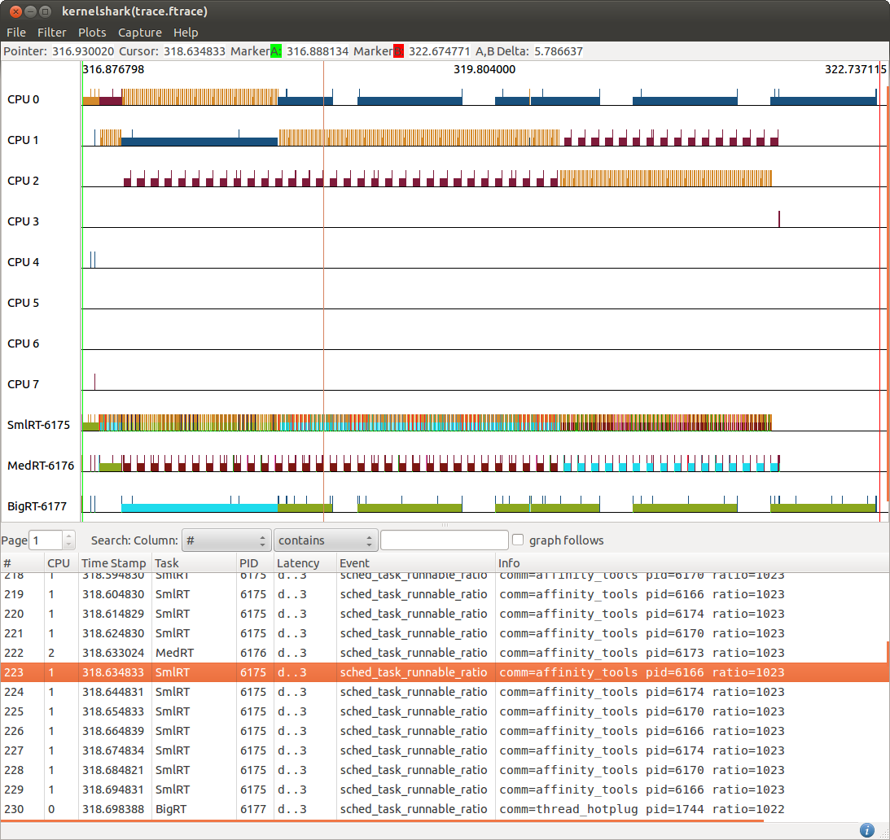

[[test_01_rttasks]]
==== RT Tasks

.Goal
Assert that RT tasks workload runs only on LITTLE CPUs

.Detailed Description
Real-Time tasks are usually considered not CPU demanding activities while being
sensible to latencies. The big.LITTLE MP scheduler extensions enforce these
tasks to run on LITTLE CPUs where, thanks to their higher priority with respect
to CFS tasks, they are expected to have all the required computational
resources to satisfy their latency expectations.

An example of real-time workload is provided using the rt-app to simulate a set
of three RT tasks with different timing requirements and generated CPU load.

This testcase checks that all RT tasks in a system are always scheduler on
LITTLE CPUs independently from the actual load they generate.

.Expected Behavior
The expected behavior is reported in the following figure:

Three tasks (SmallRT, MedRT and BigRT) are generated since the beginning,
[green]#green marker#, running on LITTLE CPUs.  The test is successfull is
these tasks are never moved to run on big CPUs.

It is worth to notice that the RT tasks could also generate a really high
workload, nevertheless they must never be migrated to big CPUs.

.Possible issues

. RT tasks are explicitly pinned on big CPUs by some user-space tools, i.e. not
  because of an HMP migration events.
. the priority filer support is disabled in the kernel in use,
  check to have the CONFIG_SCHED_HMP_PRIO_FILTER option enabled
