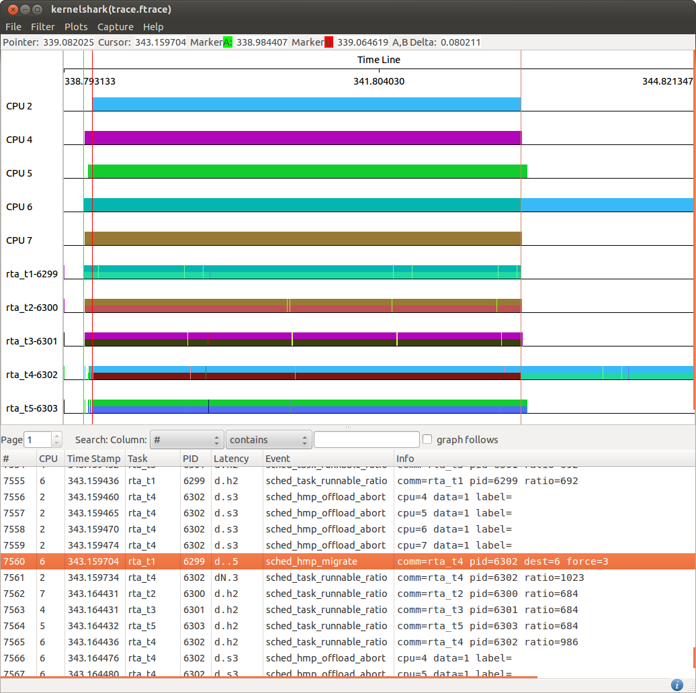

[[test_02_bigtasks]]
==== Big Tasks

.Goal
Assert that big tasks workload runs on big CPUs as soon as possible.

.Detailed Description
Big tasks are always expected to run on big CPUs as soon as one of such CPUs is
available.  Indeed, the big.LITTLE MP scheduler extensions enforce just a
single big task per big CPU at each time, in order to optimize its performance
by reducing contention on local resources with other tasks.

An example of a task workload suitable for a big CPU is provided by using
rt-app to simulate a number of batch tasks where the number is one more than
the number of big CPUs.

.Expected Behavior
The expected behavior is reported in the following figure:

The platform used in this example is a big.LITTLE system with 4xA7 and 4xA15.
Thus, an initial set of 5 batch tasks are generated, [green]#green marker#, all
staring on big CPUs because of the FORK migration mechanism.
After ~80[ms], [ref]#red marker#, one of such batch tasks is migrated on the
LITTLE CPU 2. This allows 4 big tasks to run alone each one on a big CPU to
complete as soon as possible.
As soon as a big CPU becomes free, [orange]#orange marker#, the task previously
moved on CPU2 is immediately migrated on the now free CPU 6 thanks to the
IDLE-PULL migration mechanism.

.Possible issues

. down migration threshold saturated
. other big tasks running while the experiment is executed

